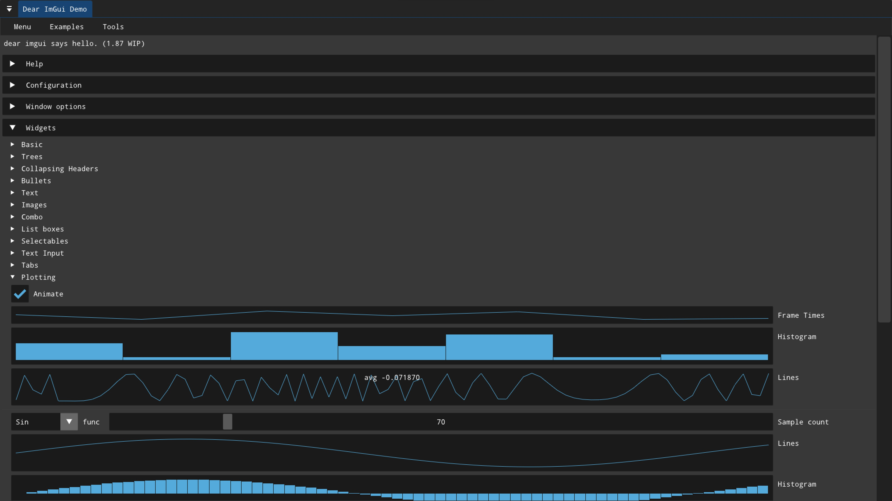

# C++ UI Template
[](https://github.com/m516/Cpp-UI-Template/actions/workflows/cmake-ubuntu.yml)
[](https://github.com/m516/Cpp-UI-Template/actions/workflows/cmake-windows.yml)
[](https://github.com/m516/Cpp-UI-Template/issues)
[[](https://github.com/m516/Cpp-UI-Template/network/members)
[[](https://github.com/m516/Cpp-UI-Template/graphs/traffic)
[[](https://github.com/m516/Cpp-UI-Template/blob/master/LICENSE)

A framework for making snappy, interactive, touch-friendly user interfaces with OpenGL 3+. 




# Contents
- [C++ UI Template](#c-ui-template)
- [Contents](#contents)
- [Setup (Ubuntu)](#setup-ubuntu)
- [Features](#features)
  - [Apps (`App::App`)](#apps-appapp)
    - [The whole example](#the-whole-example)
  - [Process (`Pipeline::Process`)](#process-pipelineprocess)
- [Libraries and Licenses](#libraries-and-licenses)


--------------------------

# Setup (Ubuntu)
Copy and paste this code to get started. `libopencv-dev` is only required in the [`with-opencv` branch](https://github.com/m516/Cpp-UI-Template/tree/with-opencv)

```sh
# Install dependencies
sudo apt-get update
sudo apt-get install -y build-essential git make cmake libopencv-dev xorg-dev
# Clone the repository (with libraries)
git clone https://github.com/m516/Cpp-UI-Template.git --recursive
# Building
cd Cpp-UI-Template
cmake .
make -j$(nproc)
```

The binary is in the src/ folder for some reason. I'll have to check that out 🤔

--------------------

# Features
I use this project as a template to quickly build and visualize interactive, multithreaded computer vision applications with OpenCV, and you can too. Every class can be an `App::App`, a `Pipeline::Process`, or both.

## Apps ([`App::App`](src/ui/app.hpp))
Apps are instances of classes that inherit `app::App` to create new tabs in the UI. All the low-level graphics are handled in the [UI namespace](src/ui/ui.hpp), so we can just focus on creating and using ImGui widgets.

Making an App is easy. Create a new folder in `src/apps` with the name of the app. Inside the folder make a new header. Name it something uselessly nebulous like "app.hpp"

Include important things:
```cpp
#pragma once
#include "ui/app.hpp"     // For the app template
#include <imgui/imgui.h>  // For making widgets
```

There a special namespace "apps" for all your apps. Make the class there so you don't mess up anyone else's code. Inherit  the `app::App` for access to the UI.
```cpp
namespace Apps{
class ImGui_Demo: public app::App{
    public:
```

Apps can inherit three methods: 
* `void uiInit()`, run once as soon as the app is initialized
* `void uiDraw()`, run repeatedly every frame.
* `void uiClose()`, run once when the app is closing.

Let's make a window with a button:
```cpp
    virtual void uiDraw(){
        ImGui::Begin("The Do-Nothing Button");
        ImGui::Button("Press me");
        ImGui::End();
    }
```
Note that ImGui documentation can be found in [its demo](https://github.com/m516/Cpp-UI-Template/blob/master/thirdparty/imgui/imgui_demo.cpp)

That's it! Now create the app in `main/main.cpp` and run the UI:
```cpp
int main()
{
    Apps::ImGui_Demo imgui_demo;
    imgui_demo.uiInit();

    UI::init();
    while(UI::Window::window) UI::update();
    return 0;
}
```
**Important:** Make sure all UI's are initialized BEFORE running `UI::init()`. I get that this process is extremely clunky, and I'll try to fix it soon.

Also, if you make any implementation (.cpp) files for your apps, make sure those are included in [src/CMakeLists.txt](src/CMakeLists.txt). (I know, this is also super inconvenient. I won't make any promises, but there might be an update that makes this step unnecessary.)

### The whole example
```cpp
#pragma once
#include "ui/app.hpp"
#include <imgui/imgui.h>


namespace Apps{

class ImGui_Demo: public app::App{
    public:

    virtual void uiDraw(){
        ImGui::ShowDemoWindow(NULL);
    }

}; // End class ImGui_Demo

} // End namespace Apps
```

## Process ([`Pipeline::Process`](src/utils/pipeline.hpp))
Extending [`Pipeline::Process`](src/utils/pipeline.hpp) allows a class to take any data from another Process, do something with the data **when new data arrives, concurrently while the previous process is getting more data**, and makes it available for other Processes. For example, a [Webcam](https://github.com/m516/Cpp-UI-Template/tree/with-opencv/src/apps/Webcam) can be a Process and grab image frames as quickly as possible. As soon as a frame is received, it can be passed to a [Thresholding module](https://github.com/m516/Cpp-UI-Template/tree/with-opencv/src/apps/Thresholding) that begins processing the data almost immediately.


There are three parts to a process:
  * **Constructing the process.** The constructor of a Process only has one input: the Process where data is coming from. The input and output data types are template parameters, so you get to choose what comes in and goes out. (i.e., Process is defined as: `template<typename InType, typename OutType> class Process`)
  * **`virtual void processOnce()`**: override this to process the data one time. Data comes fom `*process_in`, a pointer of the input type. Make sure to put the results of your computation in `process_out`.
  * **`startProcessingContinuallyInNewThread()`**: Call this somewhere to spawn a new thread that runs `processOnce()` *only* when there is new data in `process_in`.

Processes can also be combined with Apps to make blazing fast UIs! `Webcam` and `Threshold` are both Processes and Apps. They can render data as an App in real time while simultaneously getting more data as a Process. To try them out, check out and build the project in the [`with-opencv` branch](https://github.com/m516/Cpp-UI-Template/tree/with-opencv) and build the project.


----------------
**Note: More extensive documentation is underway, but the [existing apps](https://github.com/m516/Cpp-UI-Template/tree/with-opencv/src/apps) can be used for reference.** 

----------------

# Libraries and Licenses
My work is under the [MIT License](https://github.com/m516/Cpp-UI-Template/blob/with-opencv/LICENSE) with libraries whose licenses are as follows:


|                           Name |                                                         Installation instructions                                                         | License                                                                            | Github Repository                            |
| -----------------------------: | :---------------------------------------------------------------------------------------------------------------------------------------: | :--------------------------------------------------------------------------------- | :------------------------------------------- |
|  [OpenCV](https://opencv.org/) |   [official instructions as of 7/13/2020 (volatile)](https://docs.opencv.org/master/df/d65/tutorial_table_of_content_introduction.html)   | [3-clause BSD License](https://opencv.org/license/)                                | [yes](https://github.com/opencv/opencv)      |
| [GLAD](https://glad.dav1d.de/) | Included in project [(Unofficial instructions)](https://learnopengl.com/Getting-started/Creating-a-window) (path to KHR library modified) | [Varies](https://github.com/Dav1dde/glad#whats-the-license-of-glad-generated-code) | [Generator](https://github.com/Dav1dde/glad) |
|  [GLFW](https://www.glfw.org/) |                        Included in project [(Official instructions)](https://github.com/glfw/glfw#compiling-glfw)                         | [zlib license](extern/glfw/LICENSE)                                                | [yes](https://github.com/glfw/glfw)          |
|                          ImGui |                                                   Included in project (static library)                                                    | [MIT License](extern/imgui/LICENSE)                                                | [yes](https://github.com/ocornut/imgui)      |


